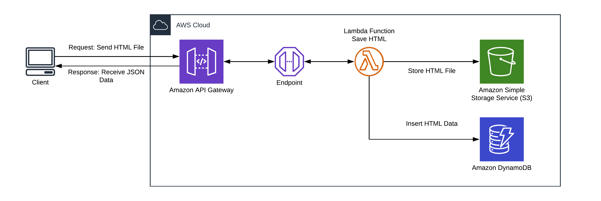

# Introdução do Projeto 

Este projeto tem o objetivo de criar uma API para processar um arquivo
HTML de um processo jurídico do Tribunal de Justiça do Estado de São Paulo
e retornar um JSON com dados referente ao Número do Processo, Valor da Causa,
Classe, Juiz, Partes do Processo e Última Movimentação. Para 
construir a API, foi usado serviços da Amazon Web Services (AWS).
 Na Figura 1 abaixo é demonstrado a comunicação entre os serviços. 



Inicialmente, o usuário irá realizar uma requisição do tipo **POST**, para o link https://ij3hepb6ck.execute-api.sa-east-1.amazonaws.com/v2/save-html,
com um binário do arquivo HTML no corpo da requisição. O serviço Amazon
API Gateway irá enviar a requisição para uma função Lambda 
desenvolvida na linguagem Python. A função Lambda irá armazenar o arquivo HTML
no Amazon Simple Storage Services (S3) e processar este arquivo
para obter os dados de interesse. Os dados são organizados no formato JSON
e armazenado no Amazon DynamoDB. No final do processo, este JSON é retornado
para o usuário.

## Código Lambda

O código Lambda com os algoritmos para processar o arquivo HTML se encontram no diretório 'src/lambda_aws.py'.
Três bibliotecas usadas para auxiliar o processamento, **python-magic**, **BeautifulSoup** e **html-parser**, 
não estão presentes no ambiente da Amazon. Para
usá-las, foi necessário instalar as bibliotecas em um diretório local e
 compactá-las em conjunto com a função Lambda:
 
 ```bash
pip3 install --target env/ python-magic
pip3 install --target env/ bs4
pip3 install --target env/ html.parser

cp src/lambda_aws.py env/
zip -r9 function.zip env/
```

E por fim, enviar o arquivo .ZIP para AWS:

```
aws lambda update-function-code --function-name save_html \
        --zip-file fileb://env/function.zip 
```

No diretório env/ contém um arquivo .ZIP de exemplo.


 